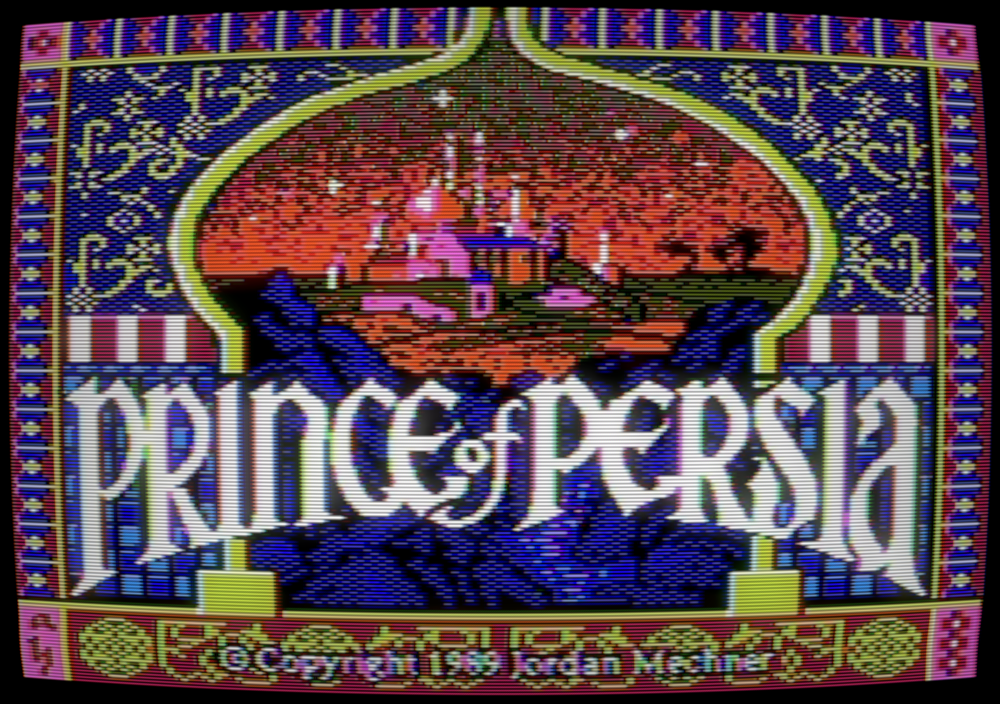
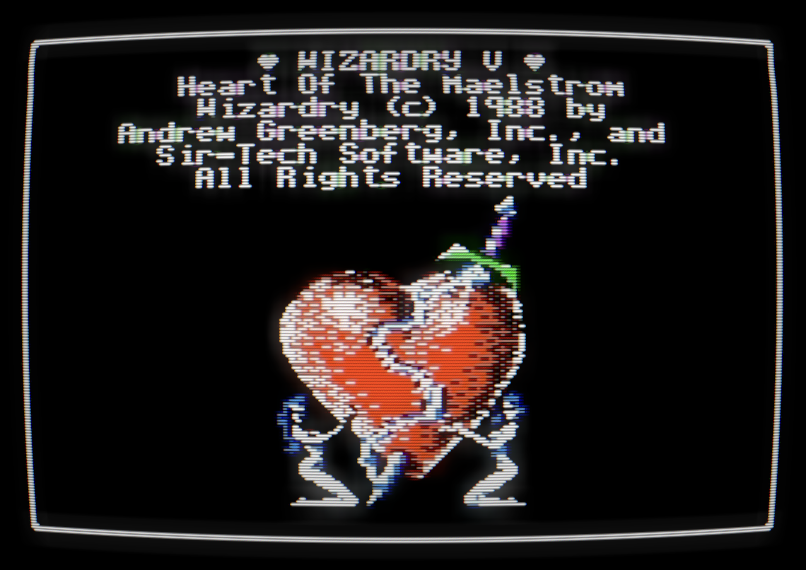
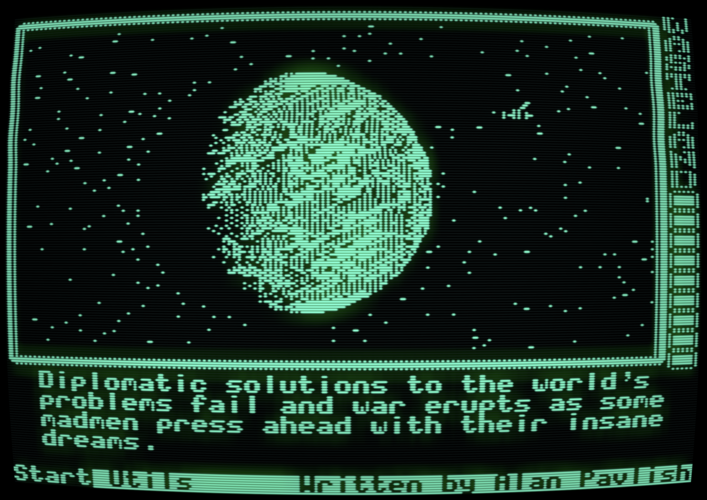
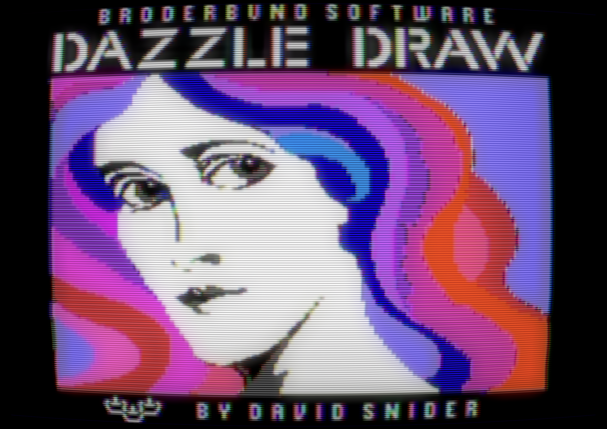
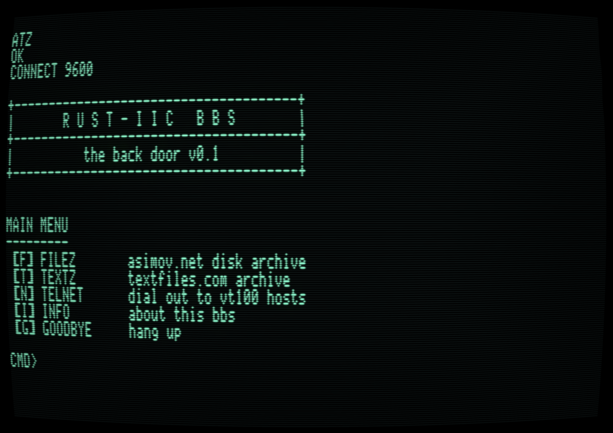
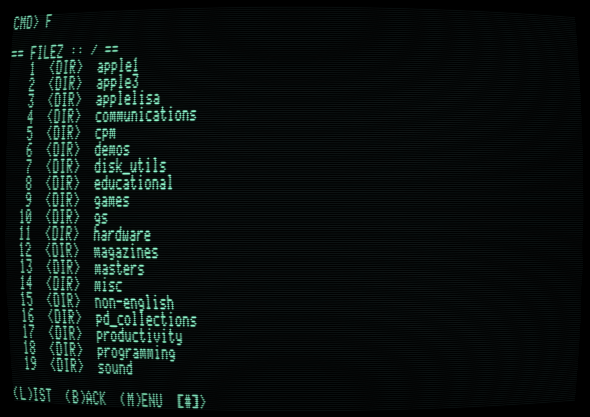
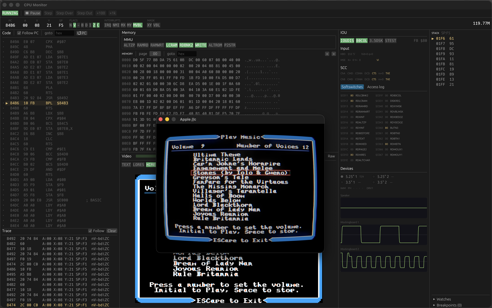

# rust-iic

A cycle-accurate Apple //c emulator.

<table>
<tr>
<td width="50%"></td>
<td width="50%"></td>
</tr>
<tr>
<td width="50%"></td>
<td width="50%"></td>
</tr>
</table>

## Specs

| | |
|---|---|
| Processor | 65C02 @ 1.023 MHz (8 MHz via optional ZIP CHIP II-8) |
| Memory | 128 KB RAM, 32 KB ROM, 1 MB expansion (slot 4) |
| Text | 40 / 80 column, 24 lines |
| Graphics | Lo-Res 40x48 (16 colors), Hi-Res 280x192 (6 colors), Double Hi-Res 560x192 (16 colors), Mixed mode, NTSC |
| Display | CRT (monochrome/color), LCD |
| Sound | Speaker, up to 2x Mockingboard (4x AY-3-8910) |
| Storage | 2x 5.25" floppy (WOZ / DOS / ProDOS / nibble / 2mg), 2x 3.5" SmartPort floppy, 2x SmartPort hard disk (HDV) |
| Input | Keyboard, mouse, paddles |
| Serial | Zilog 8530 SCC, Hayes modem emulation, TCP networking |

## Install

### From source (recommended)

```
rustup update stable
cargo install --git https://github.com/alivesay/rust-iic --locked
```

The binary lands in `~/.cargo/bin/rust-iic`.  Or clone and run from a
checkout:

```
git clone https://github.com/alivesay/rust-iic
cd rust-iic
cargo run --release -- [disk] [options]
```

Requires a Rust toolchain and a working GPU (Metal / Vulkan / DX12).

#### Linux build deps

```
sudo apt install \
  libasound2-dev libudev-dev libx11-dev libxcb1-dev \
  libxkbcommon-dev libwayland-dev pkg-config
```

(or the equivalent packages on your distro)

#### Optional: cc65

The repo ships prebuilt `build/asm/*.bin` for the embedded 6502
helpers, so cc65 is **not** required for a normal build.  Install
[cc65](https://cc65.github.io/) only if you plan to edit `asm/*.s`
sources, the build script will pick it up automatically and
regenerate the binaries.

### Prebuilt binaries

[Releases](../../releases) has tarballs / zips for macOS (Apple
Silicon), Linux x86_64, and Windows x86_64.  These are convenience
builds, not signed / notarized.

**macOS:** Apple flags unsigned downloads as "damaged."  Either build
from source or clear the quarantine flag once:

```
xattr -dr com.apple.quarantine $YOUR_PATH/rust-iic-*-macos-arm64*
```

**Linux:** unpack the tarball; the binary expects the system libs
listed above.

**Windows:** unpack the zip; SmartScreen may warn the first time: 
"More info" → "Run anyway."

## Common Options

| Option | Description |
|--------|-------------|
| `[disk]` | Disk for drive 1 |
| `--disk2`, `--disk35`, `--disk35-2`, `--hdv`, `--hdv2` | More drives |
| `--shader none\|crt\|lcd` | Display shader (default `crt`) |
| `--monochrome` | Color off |
| `--fast-disk` | Skip rotational latency |
| `--speed <n>` | CPU speed multiplier |
| `--fullscreen` | Start fullscreen |
| `--mockingboard`, `--mockingboard2` | Mockingboards in slot 5 / 4 |
| `--zip` | ZIP CHIP II-8 |
| `--mouse`, `--paddle` | Input devices |
| `--serial host:port`, `--modem` | Serial / modem |
| `--bbs` | Boot to BBS |

Run with `--help` for the full list.

## Configuration

User state lives in `$HOME/.config/rust-iic/`:

| Path | Contents |
|------|----------|
| `iic.bin` | Apple //c ROM.  (Only $03 and $04 (4x) have been tested.) |
| `config.toml` | Persistent settings |
| `memexp.bin` | Battery-backed image of the slot-4 1 MB RAM expansion |
| `cache/asimov/` | Cached Asimov disk index + downloaded blobs |
| `cache/textfiles/` | Cached textfiles.com archive |

## Disk Formats

`.woz` (1 & 2), `.dsk`, `.do`, `.po`, `.d13`, `.nib`, `.nb2`, `.2mg`, `.2img`, `.hdv`.

Note: Non-WOZ 5.25" images are converted to WOZ and saved to working sidecar `<file>.woz`.

## Keys

| Key | Action |
|-----|--------|
| F1 | Load disk into drive 1 (5.25") |
| F2 | Load disk into drive 2 (5.25") |
| F3 | Load disk into drive 3 (3.5") |
| F4 | Load disk into drive 4 (3.5") |
| F5 | Mono / color |
| F6 | Toolbar |
| F8 | Settings |
| F7 | Shader settings |
| F9 | Drive audio |
| Ctrl+F10 | Debug logging |
| Ctrl+F11 | Reboot to BBS |
| F12 | CPU monitor |
| Cmd+Enter | Fullscreen |
| Ctrl+Backspace | Soft reset |
| Ctrl+Cmd+Backspace | Hard reset |
| Ctrl+Z | Toggle ZIP CHIP |
| Left/Right Cmd | Open / Solid Apple |
| Cmd+V | Paste text to keyboard input |

Note: When //c mouse is enabled, click the window to grab the mouse then Cmd+Tab to release.

## BBS

Launch with `--bbs` or hit Ctrl+F11 at any time to reboot the //c
directly into the in-emulator BBS terminal (`rustiic_term`).  The
term is loaded into RAM and connected to a loopback BBS.



The Asimov **FILEZ** section for example:



## CPU Monitor

F12 opens the CPU monitor:


